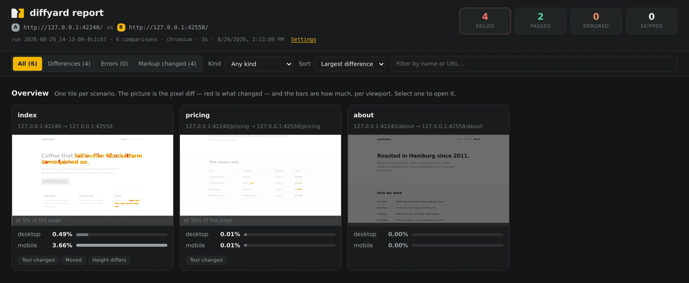

<p align="center">
  <picture>
    <source media="(prefers-color-scheme: dark)" srcset="assets/diffyard-logo-dark.svg">
    
  </picture>
</p>

<p align="center">
  Visual regression testing by comparing
  <strong>two URLs</strong> against each other.
</p>

---

Point it at an old and a new environment, list the pages you care about, and it
walks through them one after another: it opens each page on side A, performs
the interactions you configured (opening a menu, submitting a search, accepting
the consent banner), takes a screenshot, does the same on side B, and reports
what changed — as a pixel diff **and** as a structural diff of the DOM.

There is no baseline to maintain. Both sides are captured fresh on every run.

<p align="center">
  
</p>

## Contents

- [Installation](#installation)
- [Quickstart](#quickstart)
- [Configuration](#configuration)
- [Workflows](#workflows)
- [Command line](#command-line)
- [From other tools](#from-other-tools)
- [Further reading](#further-reading)

## Installation

Requires the current Node LTS (24). Install it once, then use it from any
project you want to check.

```bash
npm install -g diffyard
```

Or run it without installing anything:

```bash
npx diffyard run diffyard.yaml
```

The browser comes on first use. Playwright ships its browsers as a separate
download of a few hundred megabytes, so the first run that needs one fetches it,
says so, and carries on. `PLAYWRIGHT_SKIP_BROWSER_DOWNLOAD` leaves that to
whoever set it, which is what a CI image with its own browsers wants.

What lands is one self-contained executable with the YAML parser, the PNG codec
and the diff inlined. Only Playwright stays external, since it ships native code
and its own browser binaries.

Working on diffyard itself, rather than using it, starts at
[CONTRIBUTING.md](CONTRIBUTING.md); getting a checkout going and cutting a
release are in [MAINTAINERS.md](MAINTAINERS.md).

## Quickstart

diffyard runs **in the project you are checking**. The config lives there, and
so do the results:

```bash
cd ~/projects/my-site

diffyard init diffyard.yaml  # config + JSON schema, fully commented
$EDITOR diffyard.yaml        # put in the two URLs and the pages to compare
diffyard run diffyard.yaml
```

`init` writes the config next to a `diffyard.schema.json` that the config's
first line points at, so your editor validates and completes it while you type;
`diffyard schema` writes just that file. Both land in the current directory, as
does the report — nothing is written back to the diffyard checkout.

Or hand the two addresses to an agent and let it write the config. `diffyard`
ships an MCP server that tells the agent where the command is and how to drive
it; the agent explores the site it does not know, drafts the config against the
schema, runs the comparison and reads the results:

```bash
claude mcp add diffyard -s user -- diffyard-mcp
```

> Compare our staging site against production — https://example.ddev.site/
> and https://example.com/ — and tell me what changed.

See [Driving it from an agent](docs/with-an-agent.md) for the other clients and
what a session looks like.

```
diffyard 0.1.0
  A ddev  https://example.ddev.site/
  B live  https://example.com/
  chromium
  run 2026-08-27_14-32-10-3f9c1a
  ~/projects/my-site/.diffyard-report/2026-08-27_14-32-10-3f9c1a

[ 1/13] home @ mobile                              0.02%  PASS
[ 2/13] home @ desktop                             3.41%  FAIL
⠹ [ 3/13] ███░░░░░░░░░░░ program @ mobile  capturing live 0:41, ~2:10 left
```


### Where the results land

Every run gets its own folder, so runs can be compared against each other. The
directory is created in the working directory — the results belong to the
project being checked — and diffyard puts a `.gitignore` inside it, so a run
never ends up in a commit:

```
.diffyard-report/
  .gitignore          created by diffyard: results are artifacts, not sources
  2026-08-27_14-32-10-3f9c1a/
    index.html        side-by-side, slider, onion overlay, pixel diff, markup diff
    results.json      machine readable: ratios, thresholds, paths, errors
    data/
      run.js               what the report's overview draws
      home--desktop.js     what one comparison's detail view draws, when opened
    shots/
      home--desktop.a.webp   home--desktop.b.webp   home--desktop.diff.webp
      (no difference picture where nothing differed — see The report, below)
      home--desktop.a.html   home--desktop.b.html   home--desktop.patch
  2026-08-27_15-01-44-b17e02/
```

The screenshots are near-lossless WebP, about half the size of the same picture
as PNG — Chromium already writes PNG near its floor, so this is the only place
left where the pictures get smaller. Set `output.images: png` where something
else has to read them.

They are also what gets compared. The pixels a run reports on are the ones in
these files, not the ones that came out of the browser, so a side taken from an
earlier run has been through exactly what a side captured now has. Comparing
one against the other inflates the difference — 0.028% became 0.365% in every
pair measured — which on a `--reuse` run is a failure the page did not earn.
Measured over the comparisons sitting either side of the pass threshold, where
a shift would show, near-lossless moves the reading by 0.0014 of a percentage
point and changes no verdict.

The difference picture is the other case. Nothing reads it back — it is looked
at, to see where on the page something moved — so it is the one picture that
may lose a little, and it is stored at quality 80. The marks stay visible on
99.9% of the pixels that carry them, and every pixel that gains colour is
within two rows of a real mark: ringing around what changed, never a mark where
nothing did. Under `output.images: png` it is a palette PNG instead — the
picture holds under two hundred colours by construction, so one byte a pixel
says what three did.

`index.html` is a shell: the run itself lives in `data/`, which is why the
report opens on a run of nine hundred pages instead of parsing a hundred and
forty megabytes of markup diff to draw an overview that shows none of it. The
diff of one comparison is fetched when that comparison is opened. Both are
scripts rather than JSON because a report is opened from a `file://` URL, where
`fetch` is blocked and a script tag is not. `--self-contained` inlines all of
it again into one file that travels on its own.

The folder name is the start time plus a short hash, so it stays sortable and
two runs started in the same second cannot collide. Name a run yourself with
`--run-id`, or write straight into `--out` with `--no-run-folder`.
`--zip <file>` additionally packs the run into one archive.

Each comparison is also written on its own, next to its screenshots — see
[One file per comparison](docs/the-report.md#one-file-per-comparison). The foot
of the overview carries the settings the run used, so a finding can be traced
back to what produced it — minus anything secret, since a report is a file
people mail around. See
[What the run was told to do](docs/the-report.md#what-the-run-was-told-to-do).

### Six ways to look at one comparison

Selecting a tile opens the comparison itself. The same two screenshots are
offered six ways, because no single one answers every question.

**Diff** marks what changed in red, with a band down the right-hand edge
showing where on the page the differences sit — on a page eight thousand
pixels tall, that is what tells you where to scroll.


**Slider** wipes one side across the other, which is how a shift of a few
pixels becomes obvious. **Side by side** puts them next to each other, and
**Onion** lays one over the other at an opacity you set.


**Markup** is the pixel diff's counterpart: the serialised DOM of both sides,
line by line, so a change has an explanation and not just a percentage.
**Console** does the same for what each side logged. Under every comparison
sits the line that runs it again on its own.


## Configuration

```yaml
# yaml-language-server: $schema=./diffyard.schema.json

compare:
  a: https://example.ddev.site
  b:
    url: https://example.com
    label: live
    basicAuth: { username: staging, password: secret }

output:
  dir: .diffyard-report

browser:
  # Declared once, referenced by name from the scenarios.
  viewports:
    mobile:  { width: 375, height: 812 }
    desktop: { width: 1440, height: 900 }

diff:
  threshold: 0.001
  mask: [".carousel"]      # rotates on its own

beforeEach:
  - name: accept consent
    when: "#uc-btn-accept-banner"   # only runs when the banner is there
    once: true                      # the decision sticks for the rest of the run
    steps:
      - click: "#uc-btn-accept-banner"

scenarios:
  # A bare path is a scenario named after it, run in every viewport above.
  - /
  - /products
  - /about

  - name: home-with-menu-open
    path: /
    viewports: [mobile]
    fullPage: false
    steps:
      - click: "button.nav-toggle"
      - waitFor: ".nav--open"

  - name: contact
    a: /kontakt        # routes may differ between the two systems
    b: /contact
```

Options are grouped — `compare`, `output`, `browser`, `timeouts`, `diff`,
`stability`, `markup`, `beforeEach`, `scenarios` — and everything except
`compare` and `scenarios` has a working default. `diffyard init` writes a
configuration documenting every option, and `examples/ddev-vs-live.yaml` shows
a realistic one.

### Several sites at once

A suite is usually a handful of sites checked the same way. A group carries its
own pair of URLs and its own pages, and inherits everything it does not state:

```yaml
browser:
  viewports:
    mobile:  { width: 375, height: 812 }
    desktop: { width: 1440, height: 900 }

diff:
  threshold: 0.001

groups:
  - name: shop
    compare:
      a: https://shop.ddev.site/
      b: https://shop.example.com/
    scenarios:
      - /
      - /products
      - /cart

  - name: blog
    compare:
      a: https://blog.ddev.site/
      b: https://blog.example.com/
    viewports: [desktop]           # this one only on desktop
    waitUntil: domcontentloaded    # a site that never reaches networkidle
    steps:                         # run on every page of this group
      - click: "#accept"
    diff:
      mask: [".published-at"]      # and with its own mask
    scenarios:
      - /
      - /latest
```

Scenarios are then named `shop/products`, so two sites may both have a page
called `index`. The top-level `compare` becomes optional — leave it out when
every group brings its own. The report groups the tiles under a heading per
group with its own tally, and the command line gets a group column.

### Interactions

Steps are declarative and run in order, after the page loaded and before the
screenshot is taken:

`click` · `dblclick` · `hover` · `focus` · `fill` · `press` · `select` ·
`check` · `uncheck` · `waitFor` · `waitForHidden` · `waitForText` ·
`waitForTimeout` · `waitForUrl` · `waitForLoadState` · `scrollTo` ·
`scrollToBottom` · `scrollToTop` · `scrollBy` · `goto` · `evaluate` ·
`addStyle` · `setViewport`

Each step accepts `timeout` and `optional: true` (do not fail the scenario when
the step cannot run). Steps can be attached globally (`beforeEach`), per side
(`compare.a.steps`) or per scenario.

### beforeEach

`beforeEach` runs on every page of both sides, before the scenario's own steps.
An entry is either a plain step, or a named group with a trigger:

```yaml
beforeEach:
  - addStyle: ".chat-widget { display: none }"   # a step, runs always

  - name: accept consent
    when: "#uc-btn-accept-banner"   # only applies when this shows up
    once: true                      # a decision that sticks needs no repeating
    steps:
      - click: "#uc-btn-accept-banner"

  - name: log in
    side: b                         # only the system that needs it
    once: true
    steps:
      - goto: /login
      - fill: { selector: "#user", value: "editor" }
      - click: "button[type=submit]"
      - waitForUrl: "**/dashboard"
```

This is how consent banners are handled: **accepted, not removed**, so both
sides are captured the way a visitor sees them — and no overlay is left behind
to swallow the clicks of later steps. A banner that never appears is not an
error unless the entry sets `required: true`.

`once` also saves time: after the entry has run, later pages wait 750 ms for the
trigger instead of the full timeout, since the decision is already stored in the
browser context.

### Keeping the comparison stable

Animations, transitions and the caret are frozen, `prefers-reduced-motion` is
set, lazy loading is triggered by scrolling once, and fonts and images are
awaited before capturing. All of it is switched under `stability`, which also
holds `retries` — see
[What is held still](docs/how-it-works.md#what-is-held-still).

For content that legitimately differs, use — under `diff` for every scenario, or
on a single scenario:

- `mask` — paint the element over before the screenshot
- `hide` — `visibility: hidden`
- `remove` — drop it from the DOM (applied before the steps too, so overlays
  cannot swallow your clicks)
- `threshold` — allow a share of differing pixels

### Markup diff

Alongside the pixel comparison, the serialised DOM of both sides is diffed. It
is captured at screenshot time, so an opened menu is part of the comparison. The
report shows it with line numbers; the full unified diff lands next to the
screenshots as a `.patch` file.

```yaml
markup:
  enabled: true
  failOnDifference: false   # true = markup changes alone fail a scenario
  ignoreAttributes: [nonce, "data-reactid*"]
  ignoreSelectors: [script]
  sortAttributes: false     # true when attribute order is not stable
```

### Console output

Both sides' console output is recorded while they are photographed and compared
the same way, because a page that looks different often looks different for a
reason it already announced. The finding is the asymmetry, not the list — see
[What the page said](docs/how-it-works.md#what-the-page-said).

```yaml
logs:
  enabled: true
  levels: [error, warning, pageerror, requestfailed, httperror]
  ignore: ["Tracking Prevention blocked"]
  max: 50                   # distinct lines per side; repeats are counted
  failOnDifference: false   # true = an error on one side alone fails the case
```

### Timeouts

Three levels, so a single stuck page cannot hold up a run:

```yaml
timeout: 30000             # per Playwright action (click, waitFor, screenshot)
comparisonTimeout: 180000  # hard limit for one scenario/viewport pair
runTimeout: 0              # hard limit for the whole run, 0 = none
```

A comparison that hits its limit is reported as `TIMEOUT`, the browser contexts
are recycled, and the run continues with the next scenario.

## Workflows

### Looking at a site first

For a site you do not know, `explore` does the pass you would otherwise do by
hand — find the consent button, the menu toggle, the pages worth comparing, the
things that move on their own — and drafts a config from it:

```bash
diffyard explore https://example.ddev.site/ \
  --compare-with https://example.com/ \
  --viewport 375x812 --insecure
```

### Working through the findings one at a time

Every result carries the line that runs it again, and the report puts it under
the comparison with a copy button:

```
diffyard run diffyard.yaml --case shop--checkout--desktop --into 2026-08-28_09-16-03-24f7ce
```

`--case` is the comparison id — the same string the screenshot files are named
after — so it means that one view and nothing near it, where `--filter` is a
substring over names. `--into` writes the result back into that report,
replacing its entry and leaving the other findings standing. So the cycle is:
fix one thing, paste the line, reload the report.

The overview carries the same line for the whole run:

```
diffyard run diffyard.yaml
```

That is the other move — fix the deployment rather than one page, then look at
all of it again. It carries no `--into`, because repeating a run is running it:
a config that fixes `output.runId` has already said where the results land, and
one that does not gets a new folder, which is what a fresh run is.

Beside it are the same run with one side kept:

```
diffyard run diffyard.yaml --reuse b --reuse-from 2026-08-28_09-16-03-24f7ce
```

Usually only one side has moved — a deployment on the new system, an edit on
the old — and photographing the other again is half a run spent proving it did
not change. To capture side A again, side B is the one kept, which is what
`--reuse b` says.

And where a capture broke rather than differed, there is a line for those alone:

```
diffyard run diffyard.yaml --unfinished
```

It reads the ids out of the report instead of taking them on the command line,
because twenty of them is six hundred characters and the set is different every
time it is worked through. The report is the one the config's `output.runId`
names, or the one `--into` does.

The report stays honest about having been assembled over time: every card says
when its own picture was taken, and anything newer than the run reads
*Refreshed* — see [What a card says](docs/the-report.md#what-a-card-says).

### Keeping one side from the last run

The reference side is usually production: unchanged for hours, and the slower of
the two. Take it from the last run instead of photographing it again:

```bash
diffyard run diffyard.yaml --reuse b    # B from the last run
diffyard run diffyard.yaml --refresh b  # take B fresh again, once
```

A shot is only kept while the settings that produced it still hold, and the run
says which reference its numbers were measured against — see
[Reusing a side from an earlier run](docs/reusing-shots.md).

### Running comparisons in parallel

```bash
diffyard run diffyard.yaml --workers 4
```

or `stability.workers` in the config. Comparisons are handed to workers from one
queue, so a slow page holds up nothing but itself, and results keep their config
order however they finish. While the run is going, it says what each worker is
on:

```
  ⠋ 3/10 ━━━━━━━━━━━━ 3 of 4 workers · 8.0s · 12.8s left
    │ t3con19/speakers @ desktop    comparing              7.9s
    │ t3con19/sponsors @ mobile     capturing both sides   2.3s
    │ t3con19/sponsors @ desktop    capturing both sides   2.3s
```

Oldest first, so the list holds still while it is read. The estimate is divided
by the workers — on four of them, the sum of what is left is four times the
wait. With one worker there is no list: it would repeat the line above it.
Outside a terminal none of this is printed.

It is a trade: browsers competing for the machine render at slightly different
moments, which pages sensitive to animation or timing can pick up. Raise it for
a large suite of static pages; leave it at 1 when a difference has to be beyond
doubt.

## Command line

```bash
diffyard run <config.yaml> [options]
diffyard explore <url> [options]
diffyard init [config.yaml]
diffyard schema [file.json]
```

| Flag | Effect |
| --- | --- |
| `-o, --out <dir>` | Output directory, overrides `outDir` |
| `-f, --filter <text>` | Only scenarios whose `group/name` contains `<text>` |
| `-g, --group <name>` | Only this group, matched exactly |
| `--reuse <side>` | Take this side from an earlier run: `a`, `b` or `a,b` |
| `--reuse-from <run>` | Which run to take it from; default the newest |
| `--refresh <side>` | Capture this side even though the config reuses it |
| `--case <id>` | One comparison exactly, by its id; comma-separated for several |
| `--unfinished` | Only the comparisons that came back with nothing, read from the report |
| `--into <run>` | Write the result back into that run, replacing its entries |
| `-b, --browser <name>` | `chromium`, `firefox` or `webkit` |
| `-t, --threshold <n>` | Allowed share of differing pixels, `0..1` |
| `-w, --workers <n>` | Comparisons at once, default 1 |
| `--retries <n>` | Retry a failed capture |
| `--run-id <name>` | Name of this run's folder, default a timestamp |
| `--no-run-folder` | Write straight into `--out` |
| `--comparison-timeout <ms>` | Hard limit per comparison, default 180000 |
| `--run-timeout <ms>` | Hard limit for the whole run |
| `--headed` | Visible browser window |
| `--self-contained` | Also write `report.html` with every image inlined |
| `--zip <file>` | Also pack the run folder into an archive |
| `--junit <file>` | JUnit XML for CI test reporting |
| `--no-fail` | Always exit `0` |
| `-q, --quiet` / `--no-progress` | Less output |

Exit codes: `0` no differences, `1` at least one comparison over its threshold,
`2` a capture errored or the config is invalid.

Under the result, diffyard says so when a newer version has been published —
the step from the version in hand to the one that is out, the command that gets
it, and the release page that says what changed:

```
  diffyard 0.1.3 → 0.2.0 is out
  npm install -g diffyard@latest
  https://github.com/benjaminkott/diffyard/releases/tag/v0.2.0
```

The command is the one for how this copy was installed: `npm install -g` for a
global install, `npm install diffyard@latest` where the project being checked
carries it as a dependency, `npx diffyard@latest` for a run out of the npx
cache, and `git pull && ./install.sh` for a checkout.

The registry is asked at most once a day and the answer kept in
`~/.cache/diffyard/update.json` (or under `XDG_CACHE_HOME`); a lookup that
fails is silent and is not tried again until the next day, so being offline
costs nothing. `DIFFYARD_NO_UPDATE_CHECK=1` turns it off, as does the
conventional `NO_UPDATE_NOTIFIER`, and it never appears when `CI` is set.

## From other tools

### As an MCP server

`diffyard-mcp`, installed beside `diffyard`, tells an agent where the command
is and how to drive it. That is all it does: one tool, `diffyard_usage`, which
answers with the path and the commands, plus three resources holding the config
reference, the step vocabulary and the JSON schema.

```bash
claude mcp add diffyard -s user -- diffyard-mcp
```

From a checkout, by path: `node ~/tools/diffyard/bin/diffyard-mcp.mjs`.

There is deliberately no tool that runs a comparison or reads a result. An agent
that can run a shell can run the command itself, where it sees progress per
scenario instead of a tool call that returns nothing for minutes — and the
results are files it can open directly.

[Driving it from an agent](docs/with-an-agent.md) has the JSON form the other
clients use, what the tool and the three resources answer with, and a session
from two addresses to a finding.

### As a library

```js
import { loadConfig, run, renderReport } from 'diffyard';

const config = loadConfig('./diffyard.yaml');

const result = await run(config, {
  onComparisonDone: (comparison) =>
    console.log(comparison.scenario, comparison.diff?.ratio),
});

const html = await renderReport(result, config, { selfContained: true });
await writeFile('report.html', html);
```

## Further reading

- [How it works](docs/how-it-works.md) — row alignment, lazy loading, what is
  held still, what the page said
- [The report](docs/the-report.md) — what a card says, the kinds of difference,
  one file per comparison
- [Reusing a side from an earlier run](docs/reusing-shots.md) — fingerprints,
  what expires a shot, and how the run says so
- [Driving it from an agent](docs/with-an-agent.md) — connecting the MCP server,
  what it answers with, and why nothing in it runs a comparison

## License

MIT — see [LICENSE](LICENSE).
